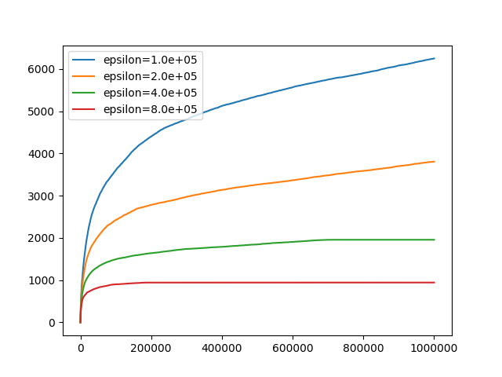

# LDP LinUCB

[](https://numpy.org/install)
[](https://github.com/huang-research-group/LDPbandit2020/search?l=python)
[](https://github.com/huang-research-group/LDPbandit2020/releases)


## Description

Locally Differentially Private (LDP) LinUCB is a variant of LinUCB bandit algorithm with local differential privacy guarantee, which can preserve users' personal data with theoretical guarantees.

The server interacts with users in rounds. For a coming user, the server first transfers the current model parameters to the user. In the user side, the model chooses an action based on the user feature to play (e.g., choose a movie to recommend), and observes a reward (or loss) value from the user (e.g., rating of the movie). Then we perturb the data to be transferred by adding Gaussian noise. Finally, the server receives the perturbed data and updates the model. Details can be found in the [paper](https://arxiv.org/abs/2006.00701).

Paper:  Kai Zheng, [Tianle Cai](https://tianle.website/), [Weiran Huang](https://www.weiranhuang.com), Zhenguo Li, [Liwei Wang](http://www.liweiwang-pku.com/), "[Locally Differentially Private (Contextual) Bandits Learning](https://arxiv.org/abs/2006.00701)", *Advances in Neural Information Processing Systems*, 2020.

Note: An earlier MindSpore-based version can be found in [MindSpore Models (Gitee)](https://gitee.com/mindspore/models/tree/master/research/rl/ldp_linucb) or [v1.0.0](https://github.com/huang-research-group/LDPbandit2020/tree/v1.0.0). 

## Dataset

Dataset used: [MovieLens 100K](https://grouplens.org/datasets/movielens/100k/) ([download](https://files.grouplens.org/datasets/movielens/ml-100k.zip))

- Dataset size: 5MB, 100,000 ratings (1-5) from 943 users on 1682 movies.
- Data format: csv/txt files.

We process the dataset by `src/dataset.py`:
We first pick out all the users having at least one rating score.
Then SVD is applied to complement missing ratings and the full rating table is obtained.
We normalize all the ratings to [-1,1].


## Installation

Unzip the MovieLens dataset and place `ua.base` in the code directory.
Then run the following commands:

```bash
python -m venv venv                 # create a virtual environment named venv
source venv/bin/activate            # activate the environment
pip install -r requirements.txt     # install the dependencies
```

Code is tested in the following environment:
- `numpy==1.21.6`
- `matplotlib==3.5.2`


## Script and Sample Code

```console
├── LDPbandit2020
    ├── ua.base                  // downloaded data file
    ├── README.md                // descriptions about the repo
    ├── requirements.txt         // dependencies
    ├── scripts
        ├── run_train_eval.sh    // shell script for training and evaluation
    ├── src
        ├── dataset.py           // dataset processing for movielens
        ├── linucb.py            // model
    ├── train_eval.py            // training and evaluation script
    ├── result1.png              // experimental result
    ├── result2.png              // experimental result
```


## Script Parameters

- Parameters for preparing MovieLens 100K dataset

  ```python
  'num_actions': 20         # number of candidate movies to be recommended
  'rank_k': 20              # rank of rating matrix completion
  ```

- Parameters for LDP LinUCB, MovieLens 100K dataset

  ```python
  'epsilon': 8e5            # privacy parameter
  'delta': 0.1              # privacy parameter
  'alpha': 0.1              # failure probability
  'iter_num': 1e6           # number of iterations
  ```


## Usage

  ```bash
  python train_eval.py --epsilon=8e5 --delta=1e-1 --alpha=1e-1
  ```

The regret value will be achieved as follows:

```console
--> Step: 0, diff: 350.346, current regret: 0.000, cumulative regret: 0.000
--> Step: 1, diff: 344.916, current regret: 0.400, cumulative regret: 0.400
--> Step: 2, diff: 340.463, current regret: 0.000, cumulative regret: 0.400
--> Step: 3, diff: 344.849, current regret: 0.800, cumulative regret: 1.200
--> Step: 4, diff: 337.587, current regret: 0.000, cumulative regret: 1.200
...
--> Step: 999997, diff: 54.873, current regret: 0.000, cumulative regret: 962.400
--> Step: 999998, diff: 54.873, current regret: 0.000, cumulative regret: 962.400
--> Step: 999999, diff: 54.873, current regret: 0.000, cumulative regret: 962.400
Regret: 962.3999795913696, cost time: 562.508s
Theta: [64.96814  26.639004  21.260265  19.860786  18.405128  16.73249  15.778397  14.784237  13.298004  12.329174  12.149574  11.159462  10.170071  9.662151  8.269745  7.794155  7.3355427  7.3690567  5.790653  3.9999294]
Ground-truth theta: [88.59274289  28.4110571  22.59921103  21.77239171  20.3727694  19.27781873  17.40422888  16.8321811  15.52599173  14.62141299  14.21670515  12.55781785  11.29962158  10.97902155  10.32499178  9.33040444  8.88399318  8.28387461  6.86420729  4.47880342]
```


## Algorithm Modification

The [original paper](https://arxiv.org/abs/2006.00701) assumes that the norm of user features is bounded by 1 and the norm of rating scores is bounded by 2. For the MovieLens dataset, we normalize rating scores to [-1,1]. Thus, we set `sigma` in Algorithm 5 to $4/\epsilon \cdot \sqrt{2  \ln(1.25/\delta)}$.


## Performance

The performance for different privacy parameters:

- X axis: number of iterations
- Y axis: cumulative regret



The performance compared with optimal non-private regret $O(\sqrt{T})$:

- X axis: number of iterations
- Y axis: cumulative regret divided by $\sqrt{T}$


It can be seen that our privacy-preserved performance is close to the optimal non-private performance.


## Citation

If you find our work useful in your research, please consider citing:

```
@article{zheng2020locally,
    title={Locally differentially private (contextual) bandits learning},
    author={Zheng, Kai and Cai, Tianle and Huang, Weiran and Li, Zhenguo and Wang, Liwei},
    journal={Advances in Neural Information Processing Systems},
    volume={33},
    pages={12300--12310},
    year={2020}
}
```
